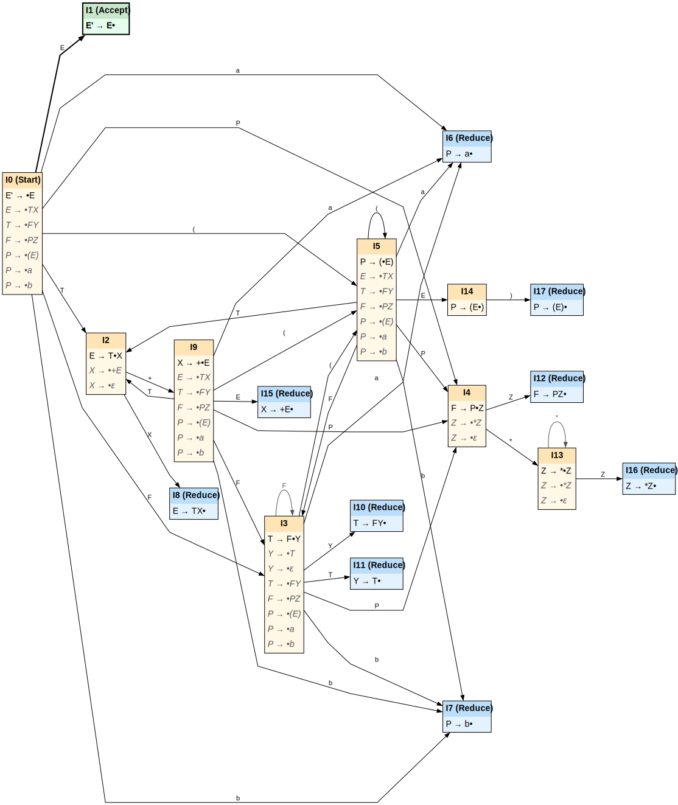

**Exercise 1:**  Consider the following grammar G, which you have seen in the previous assignment:

```
E -> TX
X -> +E | ε
T -> FY
Y -> T | ε
F -> PZ
Z -> *Z | ε
P -> (E) | a | b
```

**1. **Please construct the SLR parsing table for G. Is the grammar SLR(1)?

| **(Non-Terminal)** |        **FIRST Set**         |        **FOLLOW Set**        |
| :----------------: | :--------------------------: | :--------------------------: |
|       **E**        |       $\{ (, a, b \}$        |        $\{ \$, ) \}$         |
|       **T**        |       $\{ (, a, b \}$        |       $\{ \$, ), + \}$       |
|       **X**        |    $\{ \varepsilon, + \}$    |        $\{ \$, ) \}$         |
|       **F**        |       $\{ (, a, b \}$        |  $\{ \$, (, ), +, a, b \}$   |
|       **Y**        | $\{ \varepsilon, (, a, b \}$ |       $\{ \$, ), + \}$       |
|       **P**        |       $\{ (, a, b \}$        | $\{ \$, (, ), *, +, a, b \}$ |
|       **Z**        |    $\{ \varepsilon, * \}$    |  $\{ \$, (, ), +, a, b \}$   |
<!-- more -->
$$
\begin{aligned}
(1) & \quad E \to TX \\
(2) & \quad X \to +E \\
(3) & \quad X \to \varepsilon \\
(4) & \quad T \to FY \\
(5) & \quad Y \to T \\
(6) & \quad Y \to \varepsilon \\
(7) & \quad F \to PZ \\
(8) & \quad Z \to *Z \\
(9) & \quad Z \to \varepsilon \\
(10) & \quad P \to (E) \\
(11) & \quad P \to a \\
(12) & \quad P \to b
\end{aligned}
$$

Augmented grammar: Introduce a new symbol E' and add a new production `E' -> E`

```
I0 = closure({[E'->•E]})
   = {[E'->•E], [E->•TX], [T->•FY], [F->•PZ], [P->•(E)], [P->•a], [P->•b]}
I1 = closure(GOTO(I0, E))
   = closure({[E'->E•]})
   = {[E'->E•]}
I2 = closure(GOTO(I0, T))
   = closure({[E->T•X]})
   = {[E->T•X], [X->•+E], [X->•]}
I3 = closure(GOTO(I0, F))
   = closure({[T->F•Y]})
   = {[T->F•Y], [Y->•T], [Y->•], [T->•FY], [F->•PZ], [P->•(E)], [P->•a], [P->•b]}
I4 = closure(GOTO(I0, P))
   = closure({[F->P•Z]})
   = {[F->P•Z], [Z->•*Z], [Z->•]}
I5 = closure(GOTO(I0, ( ))
   = closure({[P->(•E)]})
   = {[P->(•E)], [E->•TX], [T->•FY], [F->•PZ], [P->•(E)], [P->•a], [P->•b]}
I6 = closure(GOTO(I0, a))
   = closure({[P->a•]})
   = {[P->a•]}
I7 = closure(GOTO(I0, b))
   = closure({[P->b•]})
   = {[P->b•]}
I8 = closure(GOTO(I2, X))
   = closure({[E->TX•]})
   = {[E->TX•]}
I9 = closure(GOTO(I2, +))
   = closure({[X->+•E]})
   = {[X->+•E], [E->•TX], [T->•FY], [F->•PZ], [P->•(E)], [P->•a], [P->•b]}
I10 = closure(GOTO(I3, Y))
    = closure({[T->FY•]})
    = {[T->FY•]}
I11 = closure(GOTO(I3,T))
    = closure({[Y->T•]})
    = {[Y->T•]}
I3 = closure(GOTO(I3, F))
   = closure({T->F•Y})
I4 = closure(GOTO(I3, P))
   = closure({[F->P•Z]})
I5 = closure(GOTO(I3, ( ))
   = closure({[P->(•E)]})
I6 = closure(GOTO(I3, a))
I7 = closure(GOTO(I3, b))
I12 = closure(GOTO(I4, Z))
    = closure({[F->PZ•]})
    = {[F->PZ•]}
I13 = closure(GOTO(I4, *))
    = closure({Z->*•Z})
    = {[Z->*•Z], [Z->•*Z], [Z->•]}
I14 = closure(GOTO(I5, E))
    = closure({[P->(E•)]})
    = {[P->(E•)]}
I2 = closure(GOTO(I5, T))
I3 = closure(GOTO(I5, F))
I4 = closure(GOTO(I5, P))
I5 = closure(GOTO(I5, ( )
I6 = closure(GOTO(I5, a))
I7 = closure(GOTO(I5, b))
I15 = closure(GOTO(I9, E))
    = closure({[X->+E•]})
    = {[X->+E•]}
I2 = closure(GOTO(I9, T))
I3 = closure(GOTO(I9, F))
I4 = closure(GOTO(I9, P))
I5 = closure(GOTO(I9, ( )
I6 = closure(GOTO(I9, a))
I7 = closure(GOTO(I9, b))
I16 = closure(GOTO(I13, Z))
    = closure({[Z->*Z•]})
	= {[Z->*Z•]}
I13 = closure(GOTO(I13, *))
I17 = closure(GOTO(I14, ) ))
	= {[P->(E)•]}
```



The SLR parsing table

<table>
    <tr>
        <td rowspan="2" align="center">
            State
        </td>
        <td colspan="7" align="center">
            ACTION
        </td>
        <td colspan="7" align="center">
            GOTO
        </td>
    </tr>
    <tr>
        <td>a</td>
        <td>b</td>
        <td>+</td>
        <td>*</td>
        <td>(</td>
        <td>)</td>
        <td>$</td>
        <td>E</td>
        <td>T</td>
        <td>X</td>
        <td>F</td>
        <td>Y</td>
        <td>P</td>
        <td>Z</td>
    </tr>
    <tr>
        <td align="center">0</td>
        <td>s6</td>
        <td>s7</td>
        <td></td>
        <td></td>
        <td>s5</td>
        <td></td>
        <td></td>
        <td>1</td>
        <td>2</td>
        <td></td>
        <td>3</td>
        <td></td>
        <td>4</td>
        <td></td>
    </tr>
    <tr>
        <td align="center">1</td>
        <td></td>
        <td></td>
        <td></td>
        <td></td>
        <td></td>
        <td></td>
        <td>acc</td>
        <td></td>
        <td></td>
        <td></td>
        <td></td>
        <td></td>
        <td></td>
        <td></td>
    </tr>
    <tr>
        <td align="center">2</td>
        <td></td>
        <td></td>
        <td>s9</td>
        <td></td>
        <td>s5</td>
        <td>r3</td>
        <td>r3</td>
        <td></td>
        <td></td>
        <td>8</td>
        <td></td>
        <td></td>
        <td></td>
        <td></td>
    </tr>
    <tr>
        <td align="center">3</td>
        <td>s6</td>
        <td>s7</td>
        <td>r6</td>
        <td></td>
        <td></td>
        <td>r6</td>
        <td>r6</td>
        <td></td>
        <td>11</td>
        <td></td>
        <td>3</td>
        <td>10</td>
        <td>4</td>
        <td></td>
    </tr>
    <tr>
        <td align="center">4</td>
        <td>r9</td>
        <td>r9</td>
        <td>r9</td>
        <td>s13</td>
        <td>r9</td>
        <td>r9</td>
        <td>r9</td>
        <td></td>
        <td></td>
        <td></td>
        <td></td>
        <td></td>
        <td></td>
        <td>12</td>
    </tr>
    <tr>
        <td align="center">5</td>
        <td>s6</td>
        <td>s7</td>
        <td></td>
        <td></td>
        <td>s5</td>
        <td></td>
        <td></td>
        <td>14</td>
        <td>2</td>
        <td></td>
        <td>3</td>
        <td></td>
        <td>4</td>
        <td></td>
    </tr>
    <tr>
        <td align="center">6</td>
        <td>r11</td>
        <td>r11</td>
        <td>r11</td>
        <td>r11</td>
        <td>r11</td>
        <td>r11</td>
        <td>r11</td>
        <td></td>
        <td></td>
        <td></td>
        <td></td>
        <td></td>
        <td></td>
        <td></td>
    </tr>
    <tr>
        <td align="center">7</td>
        <td>r12</td>
        <td>r12</td>
        <td>r12</td>
        <td>r12</td>
        <td>r12</td>
        <td>r12</td>
        <td>r12</td>
        <td></td>
        <td></td>
        <td></td>
        <td></td>
        <td></td>
        <td></td>
        <td></td>
    </tr>
    <tr>
        <td align="center">8</td>
        <td></td>
        <td></td>
        <td></td>
        <td></td>
        <td></td>
        <td>r1</td>
        <td>r1</td>
        <td></td>
        <td></td>
        <td></td>
        <td></td>
        <td></td>
        <td></td>
        <td></td>
    </tr>
    <tr>
        <td align="center">9</td>
        <td>s6</td>
        <td>s7</td>
        <td></td>
        <td></td>
        <td>s5</td>
        <td></td>
        <td></td>
        <td>15</td>
        <td>2</td>
        <td></td>
        <td>3</td>
        <td></td>
        <td>4</td>
        <td></td>
    </tr>
    <tr>
        <td align="center">10</td>
        <td></td>
        <td></td>
        <td>r4</td>
        <td></td>
        <td></td>
        <td>r4</td>
        <td>r4</td>
        <td></td>
        <td></td>
        <td></td>
        <td></td>
        <td></td>
        <td></td>
        <td></td>
    </tr>
    <tr>
        <td align="center">11</td>
        <td></td>
        <td></td>
        <td>r5</td>
        <td></td>
        <td></td>
        <td>r5</td>
        <td>r5</td>
        <td></td>
        <td></td>
        <td></td>
        <td></td>
        <td></td>
        <td></td>
        <td></td>
    </tr>
    <tr>
        <td align="center">12</td>
        <td>r7</td>
        <td>r7</td>
        <td>r7</td>
        <td></td>
        <td>r7</td>
        <td>r7</td>
        <td>r7</td>
        <td></td>
        <td></td>
        <td></td>
        <td></td>
        <td></td>
        <td></td>
        <td></td>
    </tr>
    <tr>
        <td align="center">13</td>
        <td>r9</td>
        <td>r9</td>
        <td>r9</td>
        <td>s13</td>
        <td>r9</td>
        <td>r9</td>
        <td>r9</td>
        <td></td>
        <td></td>
        <td></td>
        <td></td>
        <td></td>
        <td></td>
        <td>16</td>
    </tr>
    <tr>
        <td align="center">14</td>
        <td></td>
        <td></td>
        <td></td>
        <td></td>
        <td></td>
        <td>s17</td>
        <td></td>
        <td></td>
        <td></td>
        <td></td>
        <td></td>
        <td></td>
        <td></td>
        <td></td>
    </tr>
    <tr>
        <td align="center">15</td>
        <td></td>
        <td></td>
        <td></td>
        <td></td>
        <td></td>
        <td>r2</td>
        <td>r2</td>
        <td></td>
        <td></td>
        <td></td>
        <td></td>
        <td></td>
        <td></td>
        <td></td>
    </tr>
    <tr>
        <td align="center">16</td>
        <td>r8</td>
        <td>r8</td>
        <td>r8</td>
        <td></td>
        <td>r8</td>
        <td>r8</td>
        <td>r8</td>
        <td></td>
        <td></td>
        <td></td>
        <td></td>
        <td></td>
        <td></td>
        <td></td>
    </tr>
    <tr>
        <td align="center">17</td>
        <td>r10</td>
        <td>r10</td>
        <td>r10</td>
        <td>r10</td>
        <td>r10</td>
        <td>r10</td>
        <td>r10</td>
        <td></td>
        <td></td>
        <td></td>
        <td></td>
        <td></td>
        <td></td>
        <td></td>
    </tr>
</table>
The grammar is SLR(1), because there are no conflict during the parsing table construction.

**2.** Give the parsing steps for the input string (a∗+b)+b. If there are conflicts in the parsing table, please address them reasonably.

| LINE |    STACK     |  SYMBOLS   |   INPUT   |      ACTION      |
| :--: | :----------: | :--------: | :-------: | :--------------: |
| (1)  |      0       |     $      | (a*+b)+b$ |    shift to 5    |
| (2)  |     0 5      |    $ (     | a*+b)+b$  |    shift to 6    |
| (3)  |    0 5 6     |   $ ( a    |  *+b)+b$  |  reduce by P->a  |
| (4)  |    0 5 4     |   $ ( P    |  *+b)+b$  |   shift to 13    |
| (5)  |   0 5 4 13   |  $ ( P *   |  +b)+b$   |  reduce by Z->ε  |
| (6)  | 0 5 4 13 16  | $ ( P * Z  |  +b)+b$   | reduce by Z->*Z  |
| (7)  |   0 5 4 12   |  $ ( P Z   |  +b)+b$   | reduce by F->PZ  |
| (8)  |    0 5 3     |   $ ( F    |  +b)+b$   |  reduce by Y->ε  |
| (9)  |   0 5 3 10   |  $ ( F Y   |  +b)+b$   | reduce by T->FY  |
| (10) |    0 5 2     |   $ ( T    |  +b)+b$   |    shift to 9    |
| (11) |   0 5 2 9    |  $ ( T +   |   b)+b$   |    shift to 7    |
| (12) |  0 5 2 9 7   | $ ( T + b  |   )+b$    |  reduce by P->b  |
| (13) |  0 5 2 9 4   | $ ( T + P  |   )+b$    |  reduce by Z->ε  |
| (14) | 0 5 2 9 4 12 | $ ( T + PZ |   )+b$    | reduce by F->PZ  |
| (15) |  0 5 2 9 3   | $ ( T + F  |   )+b$    |  reduce by Y->ε  |
| (16) | 0 5 2 9 3 10 | $ ( T + FY |   )+b$    | reduce by T->FY  |
| (17) |  0 5 2 9 2   | $ ( T + T  |   )+b$    |  reduce by X->ε  |
| (18) | 0 5 2 9 2 8  | $ ( T + TX |   )+b$    | reduce by E->TX  |
| (19) |  0 5 2 9 15  | $ ( T + E  |   )+b$    | reduce by X->+E  |
| (20) |   0  5 2 8   |  $ ( T X   |   )+b$    | reduce by E->TX  |
| (21) |    0 5 14    |   $ ( E    |   )+b$    |   shift to 17    |
| (22) |  0 5 14 17   |  $ ( E )   |    +b$    | reduce by P->(E) |
| (23) |     0 4      |    $ P     |    +b$    |  reduce by Z->ε  |
| (24) |    0 4 12    |   $ P Z    |    +b$    | reduce by F->PZ  |
| (25) |     0 3      |    $ F     |    +b$    |  reduce by Y->ε  |
| (26) |    0 3 10    |    $ FY    |    +b$    | reduce by T->FY  |
| (27) |     0 2      |    $ T     |    +b$    |    shift to 9    |
| (28) |    0 2 9     |   $ T +    |    b$     |    shift to 7    |
| (29) |   0 2 9 7    |  $ T + b   |     $     |  reduce by P->b  |
| (30) |   0 2 9 4    |  $ T + P   |     $     |  reduce by Z->ε  |
| (31) |  0 2 9 4 12  |  $ T + PZ  |     $     | reduce by F->PZ  |
| (32) |   0 2 9 3    |  $ T + F   |     $     |  reduce by Y->ε  |
| (33) |  0 2 9 3 10  | $ T + F Y  |     $     | reduce by T->FY  |
| (34) |   0 2 9 2    |  $ T + T   |     $     |  reduce by X->ε  |
| (35) |  0 2 9 2 8   |  $ T + TX  |     $     | reduce by E->TX  |
| (36) |   0 2 9 15   |  $ T + E   |     $     | reduce by X->+E  |
| (37) |    0 2 8     |   $ T X    |     $     | reduce by E->TX  |
| (38) |     0 1      |    $ E     |     $     |      accept      |

**Exercise 2:** Consider the following grammar G:

```
S -> 0A
A -> S1A | ε
```

**1.** Please construct the shift-reduce parsing table for the above grammar G using each of the following algorithms: (1) SLR, (2) CLR, and (3) LALR.

(1) SLR

$FIRST(S)=\{0\}$				$FOLLOW(S)=\{1, \$\}$

$FIRST(A)=\{ε, 0\}$			    $FOLLOW(A)=\{1, \$\}$

```
(1) S -> 0A
(2) A -> S1A
(3) A -> ε
```

Augmented grammar: Introduce a new symbol S' and add a new production `S' -> S`

```
I0 = closure({[S'->•S]})
   = {[S'->•S], [S->•0A]}
I1 = closure(GOTO(I0, S))
   = closure({[S'->S•]})
   = {[S'->S•]}
I2 = closure(GOTO(I0, 0))
   = closure({[S->0•A]})
   = {[S->0•A], [A->•S1A], [S->•0A], [A->•]}
I3 = closure(GOTO(I2, S))
   = closure({[A->S•1A]})
   = {[A->S•1A]}
I4 = closure(GOTO(I2, A))
   = closure({[S->0A•]})
   = {[S->0A•]}
I2 = closure(GOTO(I2, 0))
   = closure({[S->0•A]})
I5 = closure(GOTO(I3, 1))
   = closure({[A->S1•A]})
   = {[A->S1•A], [A->•S1A], [S->•0A], [A->•]}
I3 = closure(GOTO(I5, S))
   = closure({[A->S•1A]})
I6 = closure(GOTO(I5, A))
   = closure({A->S1A•})
   = {[A->S1A•]}
I2 = closure(GOTO(I5, 0))
   = closure({[S->0•A]})
```

the shift-reduce parsing table using SLR

<table>
    <tr>
        <td rowspan="2" align="center">
            State
        </td>
        <td colspan="3" align="center">
            ACTION
        </td>
        <td colspan="2" align="center">
            GOTO
        </td>
    </tr>
    <tr>
        <td>0</td>
        <td>1</td>
        <td>$</td>
        <td>S</td>
        <td>A</td>
    </tr>
    <tr>
        <td>0</td>
        <td>s2</td>
        <td></td>
        <td></td>
        <td>1</td>
        <td></td>
    </tr>
    <tr>
        <td>1</td>
        <td></td>
        <td></td>
        <td>acc</td>
		<td></td>
        <td></td>
    </tr>
    <tr>
        <td>2</td>
        <td>s2</td>
        <td>r3</td>
        <td>r3</td>
		<td>3</td>
        <td>4</td>
    </tr>
    <tr>
        <td>3</td>
        <td></td>
        <td>s5</td>
        <td></td>
		<td></td>
        <td></td>
    </tr>
    <tr>
        <td>4</td>
        <td></td>
        <td>r1</td>
        <td>r1</td>
		<td></td>
        <td></td>
    </tr>
    <tr>
        <td>5</td>
        <td>s2</td>
        <td>r3</td>
        <td>r3</td>
		<td>3</td>
        <td>6</td>
    </tr>
    <tr>
        <td>6</td>
        <td></td>
        <td>r2</td>
        <td>r2</td>
		<td></td>
        <td></td>
    </tr>
</table>


(2) CLR

$FIRST(S)=\{0\}$				$FOLLOW(S)=\{1, \$\}$

$FIRST(A)=\{ε, 0\}$			    $FOLLOW(A)=\{1, \$\}$

```
(1) S -> 0A
(2) A -> S1A
(3) A -> ε
```

Augmented grammar: Introduce a new symbol S' and add a new production `S' -> S`

$FIRST(\$)=\{\$\}$

$FIRST(1A\$)=\{1\}$

```
I0 = closure({[S'->•S, $]})
   = {[S'->•S, $], [S->•0A, $]}
I1 = closure(GOTO(I0, S))
   = {[S'->S•, $]}
I2 = closure(GOTO(I0, 0))
   = closure({[S->0•A, $]})
   = {[S->0•A, $], [A->•S1A, $], [S->•0A, 1], [A->•, $]}
I3 = closure(GOTO(I2, S))
   = closure({[A->S•1A, $]})
   = {[A->S•1A, $]}
I4 = closure(GOTO(I2, A))
   = closure({[S->0A, $]})
   = {[S->0A•,$]}
I5 = closure(GOTO(I2, 0))
   = closure({[S->0•A, 1]})
   = {[S->0•A, 1], [A->•S1A, 1], [S->•0A, 1], [A->•, 1]}
I6 = closure(GOTO(I3, 1))
   = closure({[A->S1•A, $]})
   = {[A->S1•A, $], [A->•S1A, $], [S->•0A, 1], [A->•, $]}
I7 = closure(GOTO(I5, S))
   = closure({[A->S•1A, 1]})
   = {[A->S•1A, 1]}
I8 = closure(GOTO(I5, A))
   = closure({[S->0A•, 1]})
   = {[S->0A•, 1]}
I5 = closure(GOTO(I5, 0))
   = closure({[S->0•A, 1]})
I3 = closure(GOTO(I6, S))
   = closure({[A->S•1A, $]})
I9 = closure(GOTO(I6, A))
   = closure({[A->S1A•, $]})
   = {[A->S1A•, $]}
I5 = closure(GOTO(I6, 0))
   = closure({[S->0•A, 1]})
I10= closure(GOTO(I7, 1))
   = closure({[A->S1•A, 1]})
   = {[A->S1•A, 1], [A->•S1A, 1], [S->•0A, 1], [A->•, 1]}
I7 = closure(GOTO(I10, S))
   = closure({[A->S•1A, 1]})
I11= closure(GOTO(I10, A))
   = closure({[A->S1A•, 1]})
   = {[A->S1A•, 1]}
I5 = closure(GOTO(I10, 0))
   = closure({[S->0•A, 1]})
```

the shift-reduce parsing table using CLR

<table>
    <tr>
        <td rowspan="2" align="center">
            State
        </td>
        <td colspan="3" align="center">
            ACTION
        </td>
        <td colspan="2" align="center">
            GOTO
        </td>
    </tr>
    <tr>
        <td>0</td>
        <td>1</td>
        <td>$</td>
        <td>S</td>
        <td>A</td>
    </tr>
    <tr>
        <td>0</td>
        <td>s2</td>
        <td></td>
        <td></td>
        <td>1</td>
        <td></td>
    </tr>
    <tr>
        <td>1</td>
        <td></td>
        <td></td>
        <td>acc</td>
        <td></td>
        <td></td>
    </tr>
    <tr>
        <td>2</td>
        <td>s5</td>
        <td></td>
        <td>r3</td>
        <td>3</td>
        <td>4</td>
    </tr>
    <tr>
        <td>3</td>
        <td></td>
        <td>s6</td>
        <td></td>
        <td></td>
        <td></td>
    </tr>
    <tr>
        <td>4</td>
        <td></td>
        <td></td>
        <td>r1</td>
        <td></td>
        <td></td>
    </tr>
    <tr>
        <td>5</td>
        <td>s5</td>
        <td>r3</td>
        <td></td>
        <td>7</td>
        <td>8</td>
    </tr>
    <tr>
        <td>6</td>
        <td>s5</td>
        <td></td>
        <td>r3</td>
        <td>3</td>
        <td>9</td>
    </tr>
    <tr>
        <td>7</td>
        <td></td>
        <td>s10</td>
        <td></td>
        <td></td>
        <td></td>
    </tr>
    <tr>
        <td>8</td>
        <td></td>
        <td>r1</td>
        <td></td>
        <td></td>
        <td></td>
    </tr>
    <tr>
        <td>9</td>
        <td></td>
        <td></td>
        <td>r2</td>
        <td></td>
        <td></td>
    </tr>
    <tr>
        <td>10</td>
        <td>s5</td>
        <td>r3</td>
        <td></td>
        <td>7</td>
        <td>11</td>
    </tr>
    <tr>
        <td>11</td>
        <td></td>
        <td>r2</td>
        <td></td>
        <td></td>
        <td></td>
    </tr>
</table>

(3) LALR

```
I25 = I2 U I5 = {[S->0•A, 1/$], [A->•S1A, 1/$], [S->•0A, 1], [A->•, 1/$]}
I37 = I3 U I7 = {[A->S•1A, 1/$]}
I48 = I4 U I8 = {[S->0A•,1/$]}
I6_10 = I6 U I10 = {[A->S1•A, 1/$], [A->•S1A, 1/$], [S->•0A, 1], [A->•, 1/$]}
I9_11 = I9 U I11 = {[A->S1A•, 1/$]}
```

```
State 0: I0
State 1: I1
State 2: I25
State 3: I37
State 4: I48
State 5: I6_10
State 6: I9_11
```

<table>     
    <tr>         
        <td rowspan="2" align="center">State</td>         
        <td colspan="3" align="center">ACTION</td>         
        <td colspan="2" align="center">GOTO</td>     
    </tr>     
    <tr>         
        <td>0</td>         
        <td>1</td>         
        <td>$</td>         
        <td>S</td>         
        <td>A</td>     
    </tr>     
    <tr>         
        <td>0</td>         
        <td>s2</td>         
        <td></td>         
        <td></td>         
        <td>1</td>         
        <td></td>     
    </tr>     
    <tr>         
        <td>1</td>         
        <td></td>         
        <td></td>         
        <td>acc</td>         
        <td></td>         
        <td></td>     
    </tr>     
    <tr>         
        <td>2</td>         
        <td>s2</td>         
        <td>r3</td>         
        <td>r3</td>         
        <td>3</td>         
        <td>4</td>     
    </tr>     
    <tr>         
        <td>3</td>         
        <td></td>         
        <td>s5</td>         
        <td></td>         
        <td></td>         
        <td></td>     
    </tr>     
    <tr>         
        <td>4</td>         
        <td></td>         
        <td>r1</td>         
        <td>r1</td>         
        <td></td>         
        <td></td>     
    </tr>     
    <tr>         
        <td>5</td>         
        <td>s2</td>         
        <td>r3</td>         
        <td>r3</td>         
        <td>3</td>         
        <td>6</td>     
    </tr>     
    <tr>         
        <td>6</td>         
        <td></td>         
        <td>r2</td>         
        <td>r2</td>         
        <td></td>         
        <td></td>     
    </tr> 
</table>

**2.** Is the grammar SLR(1)? Is it LR(1)? Is it LALR(1)? 

Yes, this grammar is SLR(1), LR(1), and LALR(1). The SLR(1) parsing table with 7 states has no conflicts despite using coarser FOLLOW sets, the LR(1) (CLR) table with 12 states is conflict-free using precise lookaheads, and the LALR(1) table successfully merges core-equivalent LR(1) states back to 7 states without introducing any new conflicts.

**3.** Can an LALR(1) parser accept the string 000001111? If yes, please list the parsing steps; otherwise, please state the reason. Before parsing, please address conflicts in the parsing table if any. 

LALR(1) parser can accept the string 000001111

|  LINE  |      STACK      |     SYMBOLS     |   INPUT    |      ACTION      |
| :----: | :-------------: | :-------------: | :--------: | :--------------: |
|  (1)   |        0        |        $        | 000001111$ |    shift to 2    |
|  (2)   |       0 2       |       $ 0       | 00001111$  |    shift to 2    |
|  (3)   |      0 2 2      |      $ 0 0      |  0001111$  |    shift to 2    |
|  (4)   |     0 2 2 2     |     $ 0 0 0     |  001111$   |    shift to 2    |
|  (5)   |    0 2 2 2 2    |    $ 0 0 0 0    |   01111$   |    shift to 2    |
|  (6)   |   0 2 2 2 2 2   |   $ 0 0 0 0 0   |   1111$    |  reduce by A->ε  |
|  (7)   |  0 2 2 2 2 2 4  |  $ 0 0 0 0 0 A  |   1111$    | reduce by S->0A  |
|  (8)   |   0 2 2 2 2 3   |   $ 0 0 0 0 S   |   1111$    |    shift to 5    |
|  (9)   |  0 2 2 2 2 3 5  |  $ 0 0 0 0 S 1  |    111$    |  reduce by A->ε  |
|  (10)  | 0 2 2 2 2 3 5 6 | $ 0 0 0 0 S 1 A |    111$    | reduce by A->S1A |
|  (11)  |   0 2 2 2 2 4   |   $ 0 0 0 0 A   |    111$    | reduce by S->0A  |
|  (12)  |    0 2 2 2 3    |    $ 0 0 0 S    |    111$    |    shift to 5    |
|  (13)  |   0 2 2 2 3 5   |   $ 0 0 0 S 1   |    11$     |  reduce by A->ε  |
|  (14)  |  0 2 2 2 3 5 6  |  $ 0 0 0 S 1 A  |    11$     | reduce by A->S1A |
| （15） |    0 2 2 2 4    |    $ 0 0 0 A    |    11$     | reduce by S->0A  |
|  (16)  |     0 2 2 3     |     $ 0 0 S     |    11$     |    shift to 5    |
|  (17)  |    0 2 2 3 5    |    $ 0 0 S 1    |     1$     |  reduce by A->ε  |
|  (18)  |   0 2 2 3 5 6   |   $ 0 0 S 1 A   |     1$     | reduce by A->S1A |
|  (19)  |     0 2 2 4     |     $ 0 0 A     |     1$     | reduce by S->0A  |
|  (20)  |      0 2 3      |      $ 0 S      |     1$     |    shift to 5    |
|  (21)  |     0 2 3 5     |     $ 0 S 1     |     $      |  reduce by A->ε  |
|  (22)  |    0 2 3 5 6    |    $ 0 S 1 A    |     $      |  reduce A->S1A   |
|  (23)  |      0 2 4      |      $ 0 A      |     $      | reduce by S->0A  |
|  (24)  |       0 1       |       $ S       |     $      |      accept      |

