#####  Task 1: Create and Install a Kernel Module

simple_module.c

```c
/* simple_module.c */
#include <linux/module.h>
#include <linux/kernel.h>
#include <linux/init.h>
#include <asm/io.h>

static int __init simple_module_init(void)
{
        printk("Helloworld.\n");
        return 0;
}
/*
 *The cleanup function of the module.
 */
static void __exit simple_module_exit(void)
{
        printk(KERN_INFO"Exit.\n");
}
module_init(simple_module_init);
module_exit(simple_module_exit);

```
<!-- more -->
Makefile

```makefile
obj-m += simple_module.o

all:
        make -C /lib/modules/$(shell uname -r)/build M=$(PWD) modules

clean:
        make -C /lib/modules/$(shell uname -r)/build M=$(PWD) clean

```

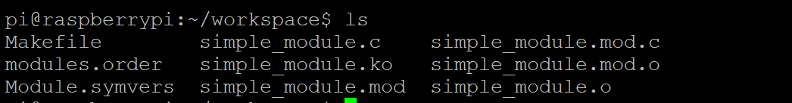

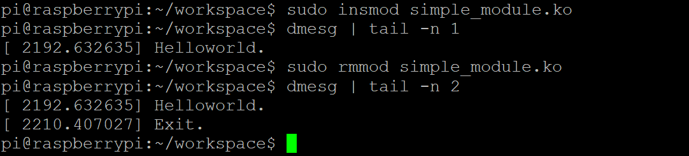

> Question 1 :
> What is the **exception level** and the **security state** of the core with loaded LKM?

The core runs at **Exception Level 1 (EL1)** and in the **Non-secure (Normal World)** security state when the LKM is loaded.

##### Task 2: Directly Access a High Privilege Register: SCR


```c
/* simple_module.c */
...
static int __init simple_module_init(void){
        uint32_t reg;
        asm volatile("mrc p15, 0, %0, c1, c1, 0":"=r"(reg));
        printk(KERN_INFO "SCR %x.\n", reg);
        return 0;
}
...
```

> Task 2.a : What is the complete instruction? Look up the manual and fill the instruction bellow. Then compile and execute.

complete instruction: 

```assembly
mrc p15, 0, <Rt>, c1, c1, 0
```

compile

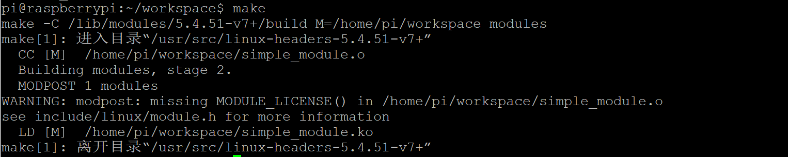

try to install this kernel module

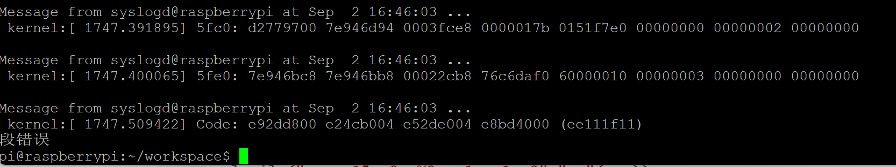

A segmentation fault occurs.

>  Task 2.b : Why the segmentation fault occurs?

The segmentation fault occurs because the kernel module executes a privileged instruction that is not allowed in the current processor mode.

Specifically, the inline assembly instruction

```assembly
mrc p15, 0, <Rt>, c1, c1, 0
```

tries to access the Secure Configuration Register (SCR), which belongs to the **secure world**.

However, the Linux kernel runs in the **non-secure world at EL1**.

##### Task 3: Read the Debug Authentication Signal

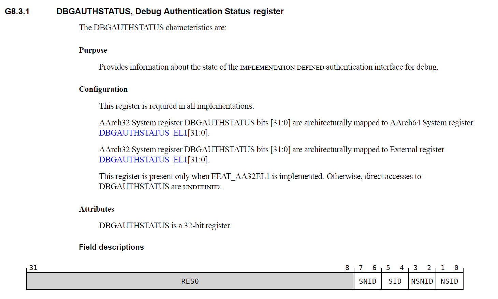

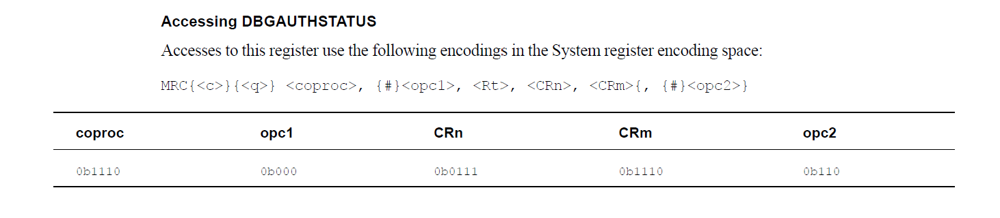

> Task 3.a: What is the instruction to read DBGAUTHSTATUS?

```assembly
mrc p14, 0, <Rt>, c7, c14, 6
```

dbgauth_module.c

```c
/* dbgauth_module.c */
#include <linux/module.h>
#include <linux/kernel.h>
#include <linux/init.h>
#include <asm/io.h>

static int __init dbgauth_init(void){
        uint32_t reg;
        printk(KERN_INFO"dbgauth_module: init - attempt to read DBGAUTHSTATUS\n");

        /* 读取 DBGAUTHSTATUS:
         * MRC p14, 0, <Rt>, c7, c14, 6
         */
        asm volatile("mrc p14, 0, %0, c7, c14, 6" : "=r"(reg));
        printk(KERN_INFO"dbgauth_module: DBGAUTHSTATUS = 0x%08x\n", reg);
        
        return 0;
}

static void __exit dbgauth_exit(void){
        printk(KERN_INFO "dbgauth_module: exit\n");
}

module_init(dbgauth_init);
module_exit(dbgauth_exit);
```

We can get DBGAUTHSTATUS after installing this kernel module

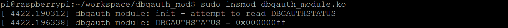

> Task 3.b : What kind of debug events are enabled?

| Field | Bits | Value | Meaning                               |
| ----- | ---- | ----- | ------------------------------------- |
| SNID  | 7–6  | 11    | Secure Non-invasive debug enabled     |
| SID   | 5–4  | 11    | Secure Invasive debug enabled         |
| NSNID | 3–2  | 11    | Non-secure Non-invasive debug enabled |
| NSID  | 1–0  | 11    | Non-secure Invasive debug enable      |

##### Task 4: Enable the Halting Debug

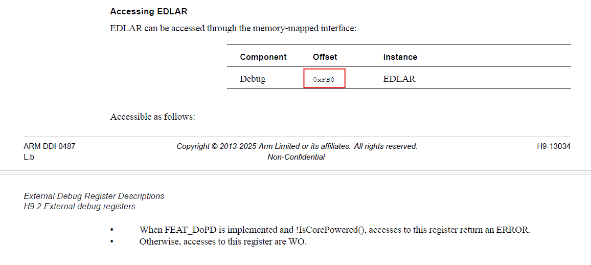

We can find that `EDLAR_OFFSET=0xFB0` 

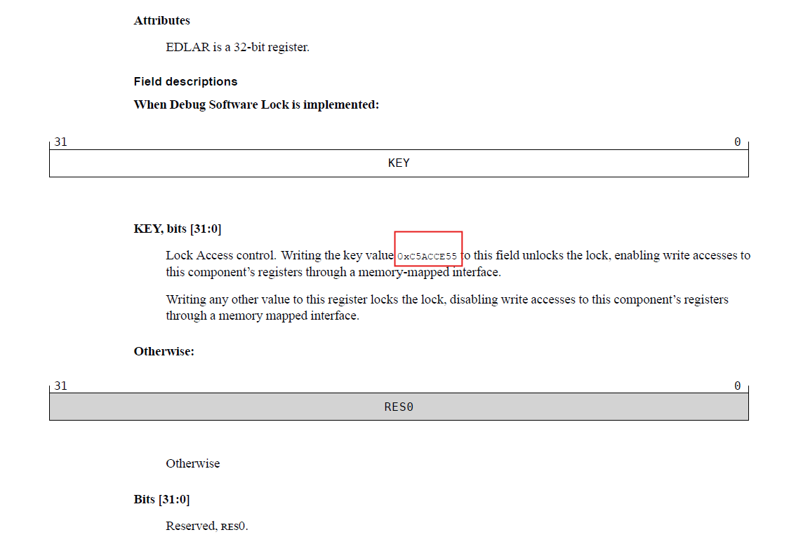

Write the key value to unlock

```c
iowrite32(0xC5ACCE55, param->debug_register + EDLAR_OFFSET);
iowrite32(0xC5ACCE55, param->cti_register + EDLAR_OFFSET);
```


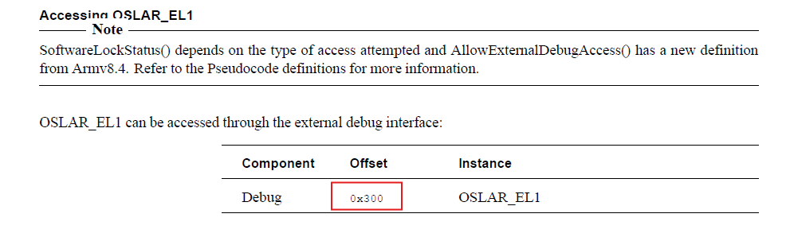

We can find that `OSLAR_OFFSET=0x300`

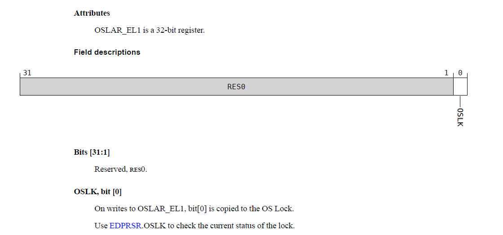

Writing 0 to the `OSLK` bit unlocks the OS,

```c
iowrite32(0, param->debug_register + OSLAR_OFFSET);
iowrite32(0, param->cti_register + OSLAR_OFFSET);
```

##### Task 5: Switch to the EL3 and read the SCR

​	Task5.a: We mention how to access SCR directly in Task2. You need to prepare an instruction, who reads SCR and store it to R1. Then convert it to machine code(do it on yourself) and execute it on the target.

```assembly
mrc p15,0,R1,c1,c1,0
```

use [Online Assembler and Disassembler](http://shell-storm.org/online/Online-Assembler-and-Disassembler/) to assemble this instruction. It yields `\x11\x1f\x11\xee` (Little Endian).

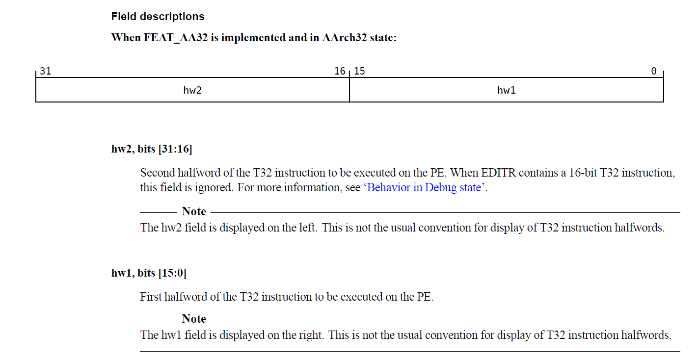

> Note: In **EDITR**, `hw2` (bits [31:16]) is the second halfword and `hw1` (bits [15:0]) is the first halfword of the T32 instruction. They are displayed in a nonstandard order (hw2 on the left, hw1 on the right).

In terms of a 32-bit value for C code execution:

```c
// 0xee111f11 <=> mrc p15,0,R1,c1,c1,0
execute_ins_via_itr(param->debug_register, 0x1f11ee11);
```

​	Task 5.b: After you finish Task 5.a , you need to transfer the value in R1 on core0, to the local variable scr. It will be printed later. DBGDTRTXint and DBGDTRTX would be helpful in your implementation

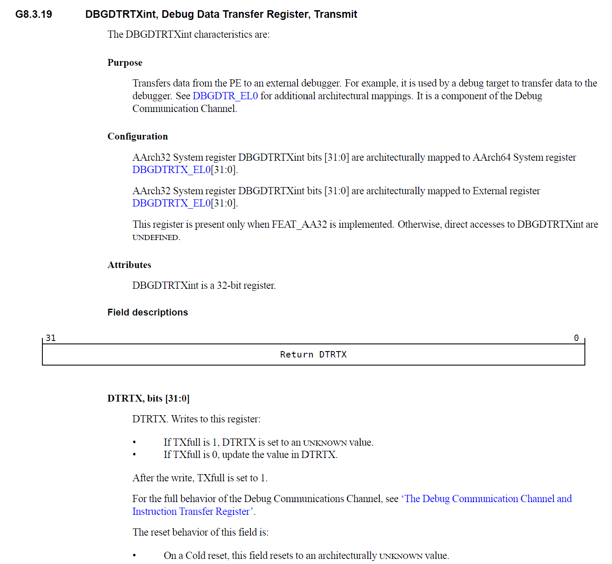


**DBGDTRTXint** is a 32-bit debug register that allows the processor to transfer data to an external debugger. It is accessed using the **MCR instruction**, for example:

```assembly
MCR p14, 0, Rt, c0, c5, 0
```

In terms of a 32-bit value for C code execution:

```c
// ee001e15 <=> mcr p14,0,R1,c0,c5,0
execute_ins_via_itr(param->debug_register, 0x1e15ee00);
```

Register DBGDTRTXint bits [31:0] are architecturally mapped to DBGDTRTX_EL0[31:0].

```c
scr = ioread32(param->debug_register + DBGDTRTX_OFFSET);
```

##### Task 6: Restore the Context and Exit

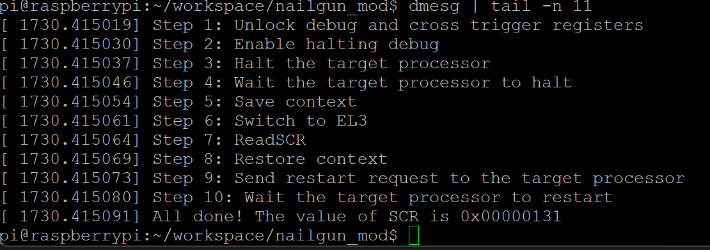

The value of SCR is `0x00000131`(`0b100110001`)

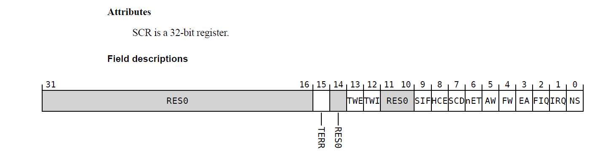

**Key meanings of SCR = 0x131**

- PE is in Non-secure state.

- An FIQ taken from either Security state is masked by PSTATE.F. When PSTATE.F is 0, the FIQ is
  taken to EL3.

- External aborts taken from either Security state are masked by PSTATE.A. When PSTATE.A is 0,
  the abort is taken to EL3.

- HVC instructions are enabled at Non-secure EL1 and EL2.


##### Question 1:

During this lab, what is the base address of Cross Trigger Interface in Raspberry Pi 3? Can your find the global address of CTICONTROL register in Raspberry Pi 3 according to the Arm Reference Manual? Answer the address value and show your calculation. (hint: Find the offset)

```c
// 0x40038000 is the base address of the cross trigger interface registers on Core 0
#define CTI_REGISTER_ADDR 0x40038000
```

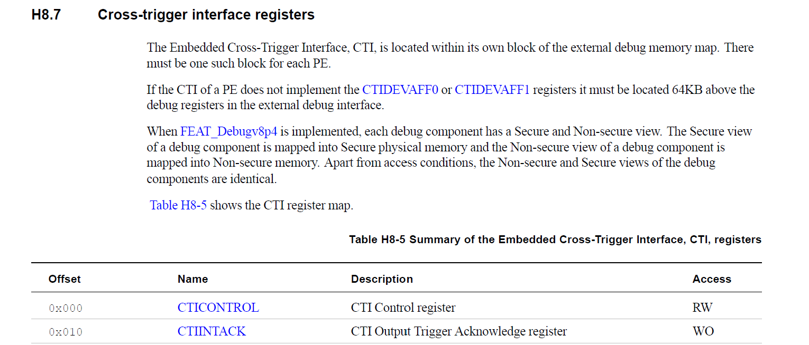

The global address of the **CTICONTROL** register is calculated as:

$$
\begin{aligned} \text{Global Address} &= \text{Base Address} + \text{Offset} \\ &= 0\text{x}40038000 + 0\text{x}0 \\ &= \mathbf{0\text{x}40038000} \end{aligned}
$$

Therefore, the **CTICONTROL register is located at address 0x40038000.**


##### Question 2:

Do we have another way to unlock the OS Lock in this lab except memory mapping? If yes, how to do that? Justify your answer.

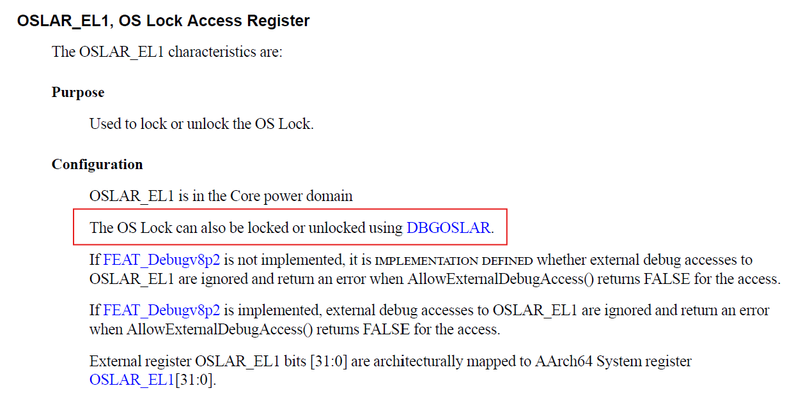

Extract Step 1 (the part that unlocks debug and cross-trigger registers) from the `read_scr()` function, and modify it so that instead of unlocking the OS Lock, it **locks** it.

```c
static void read_scr1(void *addr){
    // Step 1: Unlock debug and cross trigger reigsters
    struct nailgun_param *param = (struct nailgun_param*)addr;
    printk(KERN_INFO"Step 1: Unlock debug and cross trigger registers\n");
    iowrite32(0xC5ACCE55, param->debug_register + EDLAR_OFFSET);
    iowrite32(0xC5ACCE55, param->cti_register + EDLAR_OFFSET);
    printk(KERN_INFO"Step 1(Add): Lock OS registers\n");
    iowrite32(0xC5ACCE55, param->debug_register + OSLAR_OFFSET);
    iowrite32(0xC5ACCE55, param->cti_register + OSLAR_OFFSET);
}
```

unlock the OS Lock **by executing the code directly on core 0.**

```c
static void unlock_debug(void* _) {
	// Unlock self debug registers
	printk(KERN_INFO "Step 1(Add): unlock the OS Lock not using MAP\n");
	uint32_t reg = 0;
	asm volatile("mcr p14, 0, %0, c1, c0, 4":"=r"(reg));
}
```

Change `nailgun_init` **as follows:**

```c
smp_call_function_single(1,read_scr1,param,1);
smp_call_function_single(0, unlock_debug, param, 1);
smp_call_function_single(1,read_scr,param,1);
```

Therefore, we can unlock the OS Lock in this lab except memory mapping

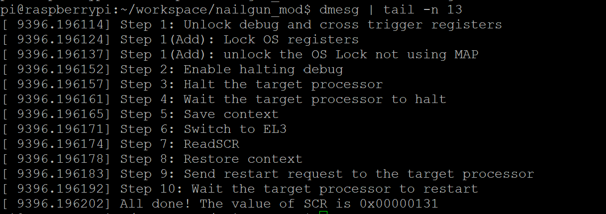